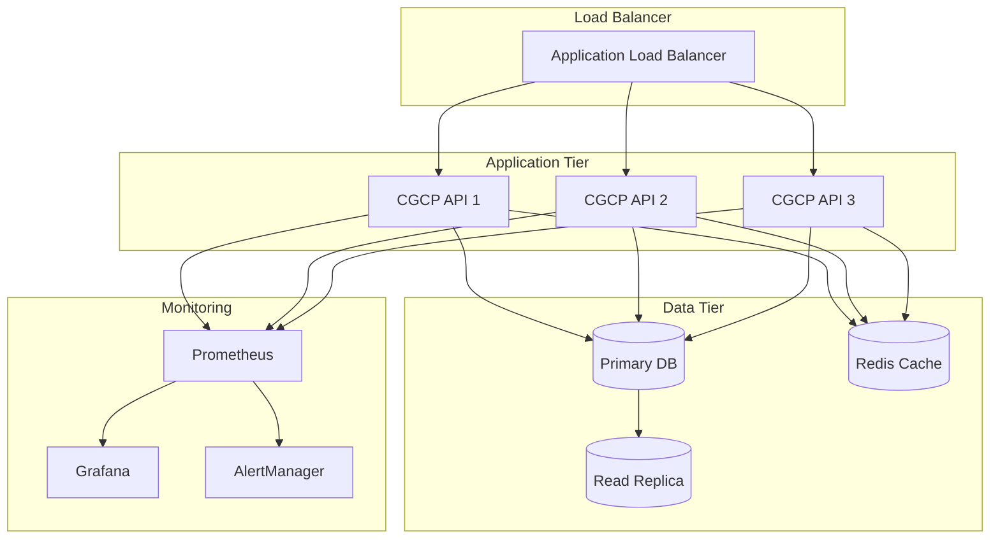

# 🚀 Claude Governance Control Plane - Deployment Guide

This guide provides comprehensive instructions for deploying the Claude Governance Control Plane (CGCP) in various environments, from local development to production cloud deployments.

## 📋 Table of Contents

1. [Prerequisites](#prerequisites)
2. [Quick Start](#quick-start)
3. [Deployment Options](#deployment-options)
4. [Production Deployment](#production-deployment)
5. [Configuration](#configuration)
6. [Monitoring & Maintenance](#monitoring--maintenance)
7. [Security Hardening](#security-hardening)
8. [Troubleshooting](#troubleshooting)

## Prerequisites

### System Requirements
- **Python**: 3.8 or higher
- **Memory**: Minimum 4GB RAM (8GB recommended for production)
- **Storage**: 10GB available space (scales with event volume)
- **OS**: Linux, macOS, or Windows with WSL2

### Software Dependencies
- Git
- Python pip
- Docker (for containerized deployments)
- kubectl (for Kubernetes deployments)
- Terraform (for cloud deployments)

## Quick Start

### 1. Clone the Repository
```bash
git clone https://github.com/dipampaul17/cgcp.git
cd cgcp
```

### 2. Local Development Deployment
```bash
# Using the automated deployment script
python deploy.py local

# Or manually
python -m venv venv
source venv/bin/activate  # Windows: venv\Scripts\activate
pip install -r requirements.txt
./start.sh
```

### 3. Verify Installation
```bash
python verify_system.py
```

### 4. Access the System
- **Dashboard**: http://localhost:8501
- **API**: http://localhost:8000
- **API Documentation**: http://localhost:8000/docs

## Deployment Options

### 🖥️ Local Deployment
Best for development and testing.

```bash
python deploy.py local
```

**Pros:**
- Quick setup
- Easy debugging
- No infrastructure costs

**Cons:**
- Not suitable for production
- Limited scalability
- No high availability

### 🐳 Docker Deployment
Containerized deployment for consistency across environments.

```bash
python deploy.py docker
```

**Custom Docker Build:**
```bash
docker build -t cgcp:latest .
docker run -d \
  --name cgcp \
  -p 8000:8000 \
  -p 8501:8501 \
  -v $(pwd)/data:/app/data \
  cgcp:latest
```

### 🎭 Docker Compose Deployment
Full stack deployment with monitoring.

```bash
python deploy.py docker-compose
```

This includes:
- CGCP application
- Prometheus monitoring
- Grafana dashboards

**Access Points:**
- Dashboard: http://localhost:8501
- API: http://localhost:8000
- Prometheus: http://localhost:9090
- Grafana: http://localhost:3000 (admin/admin)

### ☸️ Kubernetes Deployment
Production-grade deployment with auto-scaling.

```bash
python deploy.py kubernetes
```

**Manual Kubernetes Deployment:**
```bash
# Apply manifests
kubectl apply -f k8s/

# Check deployment status
kubectl get pods -l app=cgcp
kubectl get svc cgcp-service
```

**Scaling:**
```bash
kubectl scale deployment cgcp-deployment --replicas=5
```

### ☁️ Cloud Deployments

#### AWS (ECS with Fargate)
```bash
python deploy.py aws

# Or using Terraform
cd terraform
terraform init
terraform plan
terraform apply
```

#### Google Cloud Platform (Cloud Run)
```bash
# Build and push image
gcloud builds submit --tag gcr.io/PROJECT-ID/cgcp

# Deploy to Cloud Run
gcloud run deploy cgcp \
  --image gcr.io/PROJECT-ID/cgcp \
  --platform managed \
  --allow-unauthenticated \
  --port 8000
```

#### Azure (Container Instances)
```bash
# Create resource group
az group create --name cgcp-rg --location eastus

# Deploy container
az container create \
  --resource-group cgcp-rg \
  --name cgcp \
  --image cgcp:latest \
  --ports 8000 8501 \
  --cpu 2 \
  --memory 4
```

## Production Deployment

### Pre-Production Checklist

- [ ] **Security Hardening** completed
- [ ] **SSL/TLS certificates** configured
- [ ] **Authentication** enabled (OAuth2/SAML)
- [ ] **Database backups** scheduled
- [ ] **Monitoring alerts** configured
- [ ] **Load testing** completed
- [ ] **Disaster recovery** plan in place
- [ ] **Compliance requirements** verified

### High Availability Architecture



### Recommended Production Stack

1. **Load Balancer**: AWS ALB / GCP Load Balancer / Azure Application Gateway
2. **Container Orchestration**: Kubernetes (EKS/GKE/AKS)
3. **Database**: 
   - Primary: AWS RDS / Cloud SQL / Azure Database
   - Cache: Redis/ElastiCache
4. **Storage**: S3 / Cloud Storage / Blob Storage
5. **Monitoring**: Prometheus + Grafana
6. **Logging**: ELK Stack or Cloud Logging
7. **Secrets Management**: AWS Secrets Manager / GCP Secret Manager

## Configuration

### Environment Variables

```bash
# API Configuration
API_HOST=0.0.0.0
API_PORT=8000
API_WORKERS=4

# Dashboard Configuration
DASHBOARD_HOST=0.0.0.0
DASHBOARD_PORT=8501

# Database Configuration
DATABASE_PATH=/data/governance.db
DATABASE_BACKUP_ENABLED=true
DATABASE_BACKUP_INTERVAL=daily

# Security
ENABLE_AUTH=true
AUTH_PROVIDER=oauth2
JWT_SECRET_KEY=your-secret-key

# Monitoring
METRICS_ENABLED=true
PROMETHEUS_PORT=9090
```

### Policy Configuration

Edit `policy/policy_map.yaml`:

```yaml
risk_thresholds:
  cbrn:
    general: 0.15
    enterprise: 0.18
    research_sandbox: 0.25
  self_harm:
    general: 0.30
    enterprise: 0.50
    research_sandbox: 0.80
```

### RSP Configuration

Edit `policy/anthropic_rsp.yaml`:

```yaml
asl_triggers:
  asl_3:
    triggers:
      - category: cbrn
        confidence: 0.20
        description: "Biological/chemical threat enhancement"
      - category: cyber_offense
        confidence: 0.50
        description: "Autonomous cyber attacks"
```

## Monitoring & Maintenance

### Health Checks

```bash
# API Health
curl http://localhost:8000/health

# Metrics
curl http://localhost:8000/metrics

# System Verification
python verify_system.py
```

### Backup Procedures

#### Database Backup
```bash
# Manual backup
cp data/governance.db data/governance_$(date +%Y%m%d_%H%M%S).db

# Automated backup script
#!/bin/bash
BACKUP_DIR="/backups"
DB_PATH="/app/data/governance.db"
TIMESTAMP=$(date +%Y%m%d_%H%M%S)

cp $DB_PATH $BACKUP_DIR/governance_$TIMESTAMP.db

# Keep only last 7 days
find $BACKUP_DIR -name "governance_*.db" -mtime +7 -delete
```

#### Configuration Backup
```bash
tar -czf cgcp_config_$(date +%Y%m%d).tar.gz policy/ .env*
```

### Monitoring Dashboards

Grafana dashboards are available for:
- **System Overview**: Request rates, response times, error rates
- **Risk Detection**: Detection rates by category
- **Policy Enforcement**: Action distribution, ASL triggers
- **Resource Usage**: CPU, memory, disk usage

Import dashboards from `monitoring/grafana-dashboards/`.

### Alerting Rules

Configure alerts for:
- High error rate (>1%)
- ASL-3 triggers
- Database disk usage (>80%)
- API response time (>500ms p95)
- Review queue backlog (>100 items)

## Security Hardening

### 1. Enable HTTPS/TLS

```nginx
server {
    listen 443 ssl http2;
    server_name cgcp.yourdomain.com;
    
    ssl_certificate /etc/ssl/certs/cgcp.crt;
    ssl_certificate_key /etc/ssl/private/cgcp.key;
    ssl_protocols TLSv1.2 TLSv1.3;
    ssl_ciphers HIGH:!aNULL:!MD5;
    
    location / {
        proxy_pass http://localhost:8501;
        proxy_set_header Host $host;
        proxy_set_header X-Real-IP $remote_addr;
    }
    
    location /api {
        proxy_pass http://localhost:8000;
        proxy_set_header Host $host;
        proxy_set_header X-Real-IP $remote_addr;
    }
}
```

### 2. Authentication Setup

#### OAuth2 Configuration
```python
# backend/auth.py
from fastapi_oauth2 import OAuth2PasswordBearer

oauth2_scheme = OAuth2PasswordBearer(tokenUrl="token")

# Add to API endpoints
@app.get("/protected")
async def protected_route(token: str = Depends(oauth2_scheme)):
    # Verify token
    return {"message": "Authorized"}
```

### 3. Network Security

```bash
# Firewall rules (iptables)
iptables -A INPUT -p tcp --dport 8000 -s 10.0.0.0/8 -j ACCEPT
iptables -A INPUT -p tcp --dport 8501 -s 10.0.0.0/8 -j ACCEPT
iptables -A INPUT -p tcp --dport 8000 -j DROP
iptables -A INPUT -p tcp --dport 8501 -j DROP
```

### 4. Secrets Management

```bash
# Use environment variables
export JWT_SECRET_KEY=$(openssl rand -base64 32)
export DB_ENCRYPTION_KEY=$(openssl rand -base64 32)

# Or use secrets manager
aws secretsmanager create-secret \
  --name cgcp/api-keys \
  --secret-string file://secrets.json
```

## Troubleshooting

### Common Issues

#### 1. Port Already in Use
```bash
# Find and kill processes
lsof -ti:8000 | xargs kill -9
lsof -ti:8501 | xargs kill -9
```

#### 2. Database Locked
```bash
# Check for locks
fuser data/governance.db

# Remove WAL file if corrupted
rm data/governance.db.wal
```

#### 3. Memory Issues
```bash
# Increase container memory
docker update --memory 4g cgcp

# Or in docker-compose.yml
services:
  cgcp:
    mem_limit: 4g
```

#### 4. Slow Performance
- Enable database indexing
- Implement Redis caching
- Scale horizontally
- Use read replicas

### Debug Mode

```bash
# Enable debug logging
export LOG_LEVEL=DEBUG
export PYTHONUNBUFFERED=1

# Run with verbose output
python -m uvicorn backend.app:app --log-level debug
```

### Support Resources

- **Documentation**: [GitHub Wiki](https://github.com/dipampaul17/cgcp/wiki)
- **Issues**: [GitHub Issues](https://github.com/dipampaul17/cgcp/issues)
- **Discussions**: [GitHub Discussions](https://github.com/dipampaul17/cgcp/discussions)

## Next Steps

1. **Run Demo**: `python demo/production_demo.py`
2. **Configure Policies**: Customize thresholds for your organization
3. **Set Up Monitoring**: Import Grafana dashboards
4. **Enable Authentication**: Secure your deployment
5. **Schedule Backups**: Automate data protection

---

**🎉 Congratulations!** Your Claude Governance Control Plane is now deployed and ready to operationalize Anthropic's Responsible Scaling Policy.

For additional support or enterprise deployment assistance, please contact the maintainers. 